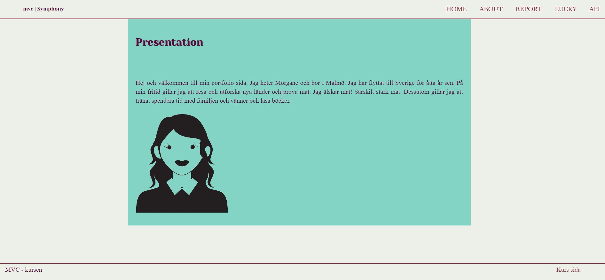

## <!--

author: mogi23
revision:
"2024-03-28": "(mogi23) First commit."
"2024-04-01": "(mogi23) Uppdated files."

---

-->

# My Symfony Report Project



[](https://scrutinizer-ci.com/g/MoRosGi/bth-Report/?branch=main)
[](https://scrutinizer-ci.com/g/MoRosGi/bth-Report/?branch=main)
[](https://scrutinizer-ci.com/g/MoRosGi/bth-Report/build-status/main)

This is the scrutinizer badges for this project.

## Introduction

This is a Symfony project created as part of a course assignment. The project includes a web application with various routes and features, as well as a JSON API.

## Getting Started

To get started with the project, you need to clone the repository and install the dependencies.
You need to have composer and PHP 3 installed.

- [Clone the repository](#clone-the-repository)
- [Install the project skeleton](#install-the-project-skeleton)
  - [install symfony](#install-symfony)
  - [install webapp](#install-webapp)
  - [install Twig](#install-twig)
  - [install Encore](#install-encore)
- [Run the app](#run-the-app)
- [Features](#features)
- [Styling](#styling)
- [Contributors](#contributors)

## Clone the repository:

On GitHub.com, navigate to the main page of the repository.
Above the list of files, click <>Code.
Copy the URL for the repository.
Open Git Bash.
Change the current working directory to the location where you want the cloned directory.
Type git clone, and then paste the URL you copied earlier.

```
git clone https://github.com//MoRosGi/bth-Report.git
```

## Install the project skeleton:

### install symfony

Replace 'app' with your chosen file.

```
composer create-project symfony/skeleton:"7.0.*" app
cd app
```

### install webapp

You can now use composer to complete the installation of the web application.

```
composer require webapp
```

### install Twig

```
# You are in the app directory
composer require twig
```

### install Encore

```
composer require symfony/webpack-encore-bundle
npm install
```

## Run the app:

You can open the PHP built-in web server to run the app local.

```
# You are in the app/ directory
php -S localhost:8888 -t public
```

## Features

- '/': Presentation of myself including an image.
- '/about': Information about the MVC course, including a link to the course's Git repository, and a link to my own GitHub repository.
- '/report': Collection of reports with links to specific sections.
- '/lucky': Page showing a dynamic value and images.
- '/api': Landing page for the JSON API.
- '/api/quote': JSON response containing today's quote, date, and timestamp.

## Styling

The website has been styled to provide a cohesive and visually appealing experience. CSS preprocessing has been used to enhance styling.

## Contributors

- mogi23 - Developer
- Acknowledgements:
  - Symfony Framework
  - Twig Templating Engine
  - Composer
